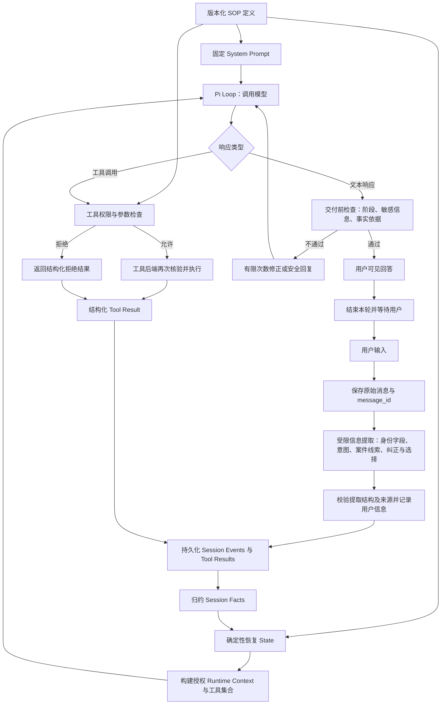
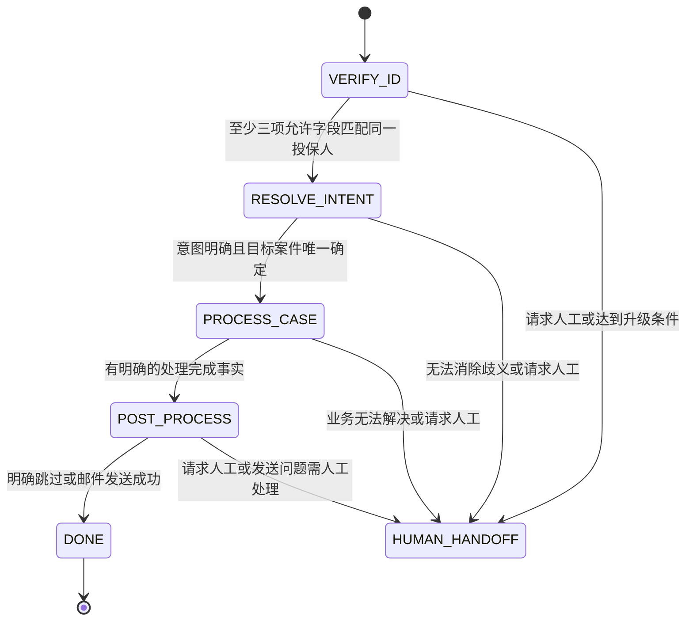

# 保险客服 Agent Loop 整体链路

本文是实现设计，不表示应用已经实现。以 Pi Agent Loop 为运行基础，在外部增加确定性的 SOP Harness。

第一阶段的提取、核验、状态恢复和边界条件详见 [VERIFY_ID 设计](phase-1-identity-verification.md)。该阶段采用 Harness 必经记录与自动核验，运行时不要求对话 LLM 依次调用记录、核验和状态恢复工具。

## 核心分工

- LLM：理解自然语言、提出结构化信息和工具调用、基于授权数据组织回答。
- Tools：执行核验、查询、决策记录和外部操作，返回结构化结果。
- Session Facts：由事件和工具结果归约得到的业务事实，保留来源与有效性。
- State：由 Facts 和版本化 SOP 规则确定性恢复的阶段、权限与待办。
- Harness：控制上下文、工具授权、阶段迁移、输出交付和执行预算。

System Prompt 告诉模型规则；Harness 在执行路径上强制规则。用户陈述、模型提取、工具核验结论具有不同可信含义。

## 整体链路图



每次工具结果落库后重新归约 Facts、恢复 State、刷新下一次模型请求的上下文。无需等待下一条用户消息才能推进符合条件的阶段。

输出检查是补充措施；首要保护是验证前不向模型提供受保护案件数据。需要交付前检查的文本应先缓冲，检查通过后再发送；已经流式发送的文字无法撤回。

## 单轮执行顺序

1. 保存原始用户消息，生成稳定的消息 ID。
2. 必经信息提取步骤产生结构化候选信息；程序验证结构与消息来源，记录用户陈述。提取可使用 LLM，但不能直接产生身份通过、授权通过或发送成功结论。
3. 从持久化事件重建 Facts；根据 SOP 版本、当前时间和 Facts 恢复 State。
4. 构建最小授权上下文，绑定当前工具集合，调用模型。
5. 模型提出工具调用时，Harness 检查阶段、权限、参数及调用预算；工具后端再次检查身份和资源归属。
6. 成功、拒绝和失败结果均记录为结构化事件，更新 Facts，进入下一次模型请求。
7. 模型产生最终文本后，经交付检查发送给用户，保存回答并结束本轮。

失败结果不得归约为成功事实。设置每轮最大模型调用数、工具调用数、修正次数和超时；达到限制后提供可恢复的回复或升级人工。

## Facts 与 State

建议事件至少包含：`event_id`、`session_id`、`type`、`source_message_id` 或 `tool_call_id`、`payload`、`timestamp`、`sop_version`。

| Facts 类别 | 示例 | 可以证明什么 |
|---|---|---|
| 用户陈述 | 姓名、生日、声称被拒赔 | 用户提供过该信息 |
| 意图与案件线索 | 医疗、1 月、询问拒赔原因 | 理解与定位的候选依据 |
| 验证结果 | 三项字段匹配同一投保人 | 当前有效的身份核验结论 |
| 查询结果 | CL-2048 状态与缺失材料 | 授权数据源在查询时的记录 |
| 客户决定 | 确认案件、结束讨论、同意或跳过邮件 | 关联具体问题的用户选择 |
| 操作结果 | 邮件发送成功、转接请求已创建 | 后端实际执行结果 |

```ts
const facts = reduceSessionEvents(events);
const state = deriveSopState(facts, sopRules, clock);
const context = buildAuthorizedContext(facts, state);
const tools = getAllowedTools(state);
```

Facts 不是简单覆盖的键值表。纠正身份字段应使相关旧核验失效；撤回同意应阻止尚未执行的发送；摘要或收件人变化应重新检查同意是否仍适用。保留历史事件，明确当前有效版本。

## SOP 阶段进入条件



`HUMAN_HANDOFF` 表示人工处理分支；请求创建、排队和转接完成应分别记录。图中 DONE 和 HUMAN_HANDOFF 是终止/分支状态，不新增核心四阶段。

| 阶段 | 必须由程序检查 | 未通过时的行为 |
|---|---|---|
| VERIFY_ID | 当前有效核验中至少三种允许字段匹配同一投保人 | 保持阶段，询问缺失项或提供替代字段 |
| RESOLVE_INTENT | 已验证；意图明确；案件归属正确；目标案件已确定 | 使用已记线索查询或澄清 |
| PROCESS_CASE | 处理已完成的明确事实，例如用户确认无需更多帮助，或已定义路径完成 | 继续解答或人工升级 |
| POST_PROCESS | 明确跳过，或有效同意下发送工具成功 | 澄清选择、处理发送失败或按策略重试 |

不提供可任意调用的 `advance_phase` 或 `set_session_fact` 工具。阶段从 Facts 推导；“已解释拒赔原因”不能自动等同于“用户问题全部解决”。

## 工具集合

| 工具 | 主要输出 | 约束 |
|---|---|---|
| record_user_information | 带来源的用户陈述与纠正 | 必经记录步骤；不产生验证结论 |
| verify_identity | 匹配字段、验证状态、内部身份绑定 | 保单号不计入三项；不泄露正确答案 |
| find_claims | 授权范围内候选案件 | party_id 由会话后端绑定 |
| select_claim | 目标案件及选择依据 | 归属正确；歧义已经解决 |
| get_claim_details | 当前案件记录 | 每次检查身份有效性与归属 |
| get_claim_guidance | 与案件有关的材料及跟进指导 | 显式处理缺失规则、冲突与过期截止日 |
| record_customer_decision | 客户选择及对应问题/消息 | 模糊表达不得直接转为发送同意 |
| prepare_summary_email | 不含多余 PII 的版本化草稿 | 仅使用授权事实 |
| send_summary_email | 发送状态与发送标识 | 同意绑定草稿及收件人；幂等执行 |
| request_human_handoff | 请求、排队或完成状态 | 不把创建请求表述为已经转接 |

核验、案件选择、客户决定、发送等会修改业务状态的操作按顺序执行。同一会话的输入和状态更新应串行化；独立只读查询可在权限稳定时并行。

## 与 Pi 的集成边界

- 模型调用前：恢复 State、刷新上下文和可执行工具。
- 工具执行前：集中授权检查；工具后端再次检查。
- 工具执行后：记录结果、归约 Facts、刷新下一次请求。
- 输出事件：连接 UI 与审计记录；UI 阶段显示取自 State。
- 框架具体 hook 名称和能力应按最终固定的 Pi 版本确认；本文描述的是实现所需边界。

## Margaret 验收链路

输入：姓名 Margaret Chen、保单 POL-9921、生日 1985-03-15、SSN 后四位 4472，并说明 1 月医疗理赔被拒。

1. 保存身份陈述与拒赔/医疗/1 月线索，仍处于 VERIFY_ID。
2. verify_identity 确认姓名、生日、SSN 后四位匹配 P9。
3. 从工具结果恢复为 RESOLVE_INTENT；使用已记线索查询，不重复询问。
4. 根据授权候选唯一确定 CL-2048，记录选择，恢复为 PROCESS_CASE。
5. 查询并解释病理报告和门诊记录缺失；日期以明确配置的演示时间或真实当前时间判断，不把已过期截止日描述成未来日期。
6. 问题处理完成后进入 POST_PROCESS；用户明确选择发送或跳过。
7. 同意发送则生成并发送摘要，以工具成功结果结束；跳过则直接结束。
